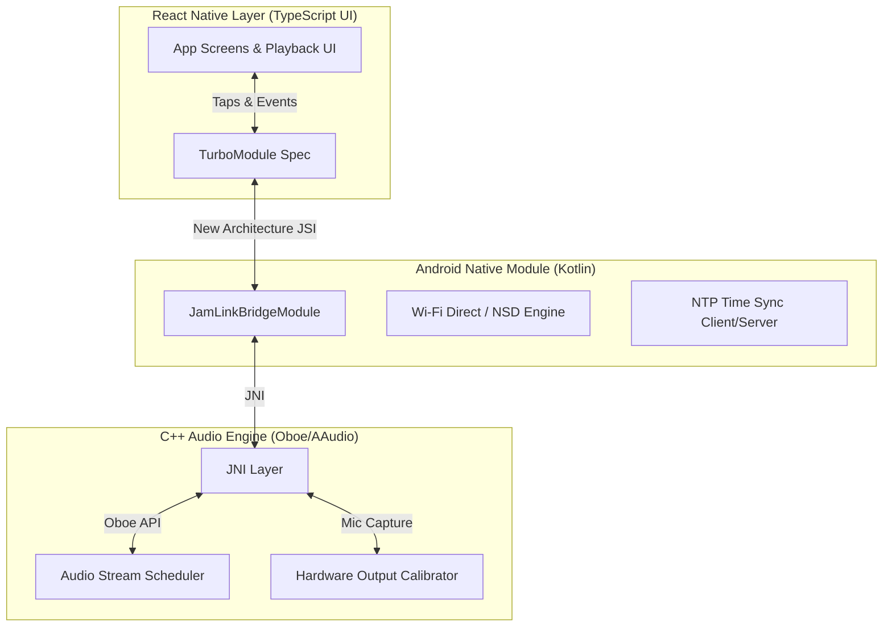

<div align="center">
  

  # JamLink
  *Local-Network Low-Latency Audio Synchronization for Live Musicians*

  [](https://reactnative.dev)
  [](https://developer.android.com)
  [](https://github.com/google/oboe)
  [](https://reactnative.dev/docs/the-new-architecture-introduction)
  
  ⭐ If you like this project, star it on GitHub!

  [Features](#features) • [Architecture](#architecture) • [Getting Started](#getting-started) • [Build Configuration](#build-configuration) • [Troubleshooting](#troubleshooting)

</div>

---

JamLink is a real-time local-network audio synchronization application tailored for live jam sessions. It enables up to **6 Android devices** (1 Master and up to 5 Clients) to connect over an offline Wi-Fi Direct peer-to-peer network and play audio in tight, perceptual synchronization (targeting a **5–15ms synchronization window**).

By utilizing a high-performance native audio scheduler and a custom peer-to-peer time sync protocol, JamLink bypasses high-latency Java-level APIs and keeps latency-critical operations running directly on the native side.

## Features

- ⚡ **Low-Latency Audio Engine**: Built in C++ using Google's Oboe (utilizing AAudio or OpenSL ES) to minimize hardware output buffer delays.
- ⏱️ **NTP-like Time Sync**: Custom high-precision time synchronization over UDP to keep clocks aligned between Master and Client devices.
- 🌐 **Offline Peer Discovery**: Automatic Wi-Fi Direct (P2P) group formation and socket management without requiring an internet connection.
- 🔗 **JSI/TurboModule Bridge**: Exposes native controls to React Native UI asynchronously using the New Architecture (JSI) to avoid JS garbage collection pauses.
- 📐 **Microphone Calibration**: Automatically measures device-specific hardware latencies via mic click tests to offset playback.

## Architecture



> [!NOTE]
> All latency-critical code (such as UDP packet transmission, time synchronization math, and Oboe playback thread callbacks) runs exclusively on high-priority native threads. The JavaScript thread is used purely for non-blocking UI rendering and user interactions.

## Getting Started

### Prerequisites

Make sure your development machine has:
- **Node.js** (>= 22.11.0)
- **Java Development Kit (JDK 17)**: JDK 17 is required for compilation. Newer versions (JDK 21+) output native-access warnings that crash the Android Gradle Plugin's `Prefab` JNI configuration.
- **Android SDK** with Command Line Tools, NDK (version `27.1.12297006`), and CMake (>= `3.22.1`)
- **Android Studio** configured for React Native

### Installation

1. Clone the repository:
   ```bash
   git clone https://github.com/reav4nn/JamLink.git
   cd JamLink
   ```

2. Install dependencies:
   ```bash
   npm install
   ```

## Build Configuration

### JDK 17 Requirement
To avoid build failures with the C++ `Prefab` packaging system, you **must use JDK 17** for compiling this project. 

Newer JDK versions (such as JDK 21 or JDK 25) introduce strict JNI/native-access checks and print warning logs (e.g., *"WARNING: A restricted method in java.lang.System has been called"*). The Android Gradle Plugin parses stderr during Prefab package generation and treats these JVM warnings as fatal configuration crashes.

If your system-default Java is newer than JDK 17:
1. Install JDK 17.
2. Point your `JAVA_HOME` environment variable to the JDK 17 path (e.g. `export JAVA_HOME=/usr/lib/jvm/java-17-openjdk`) before running `./gradlew`.
3. If building via Android Studio, configure **Settings > Build, Execution, Deployment > Build Tools > Gradle > Gradle JDK** to target JDK 17.

### Offline JS Bundling
When running on physical devices without access to a running Metro server over the same network, bundle the JS assets directly into the application package prior to installation:

```bash
npx react-native bundle --platform android --dev true --entry-file index.js --bundle-output android/app/src/main/assets/index.android.bundle --assets-dest android/app/src/main/res/
```

Then install the build on your device:

```bash
cd android && ./gradlew installDebug
```

## Troubleshooting

### Android Wi-Fi Direct Permissions
- Ensure that **Location (GPS)** is enabled on your device. Android requires Location services to scan for Wi-Fi Direct peers.
- Click the **Perms** button in the app on first launch to request the required runtime permissions (`ACCESS_FINE_LOCATION` and on Android 13+, `NEARBY_WIFI_DEVICES`).

### Reason Code: 2 (BUSY)
If clicking **Master (Group)** or **Start Discover** fails with `Reason Code: 2`, it indicates the Wi-Fi framework is busy:
1. Check that Wi-Fi is enabled (it does not need to be connected to a router, but the antenna must be turned ON).
2. Tap the **Disconnect** button in the app to clear any stale background groups or connection states.
3. Turn your device's Wi-Fi toggle OFF and ON again to reset the Android P2P framework state.
